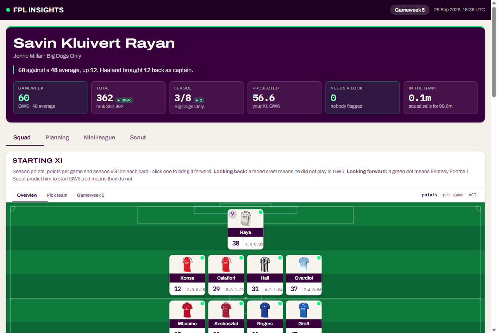
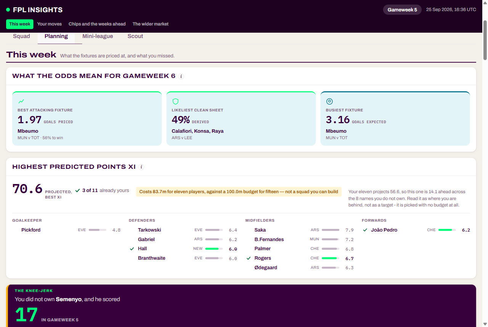
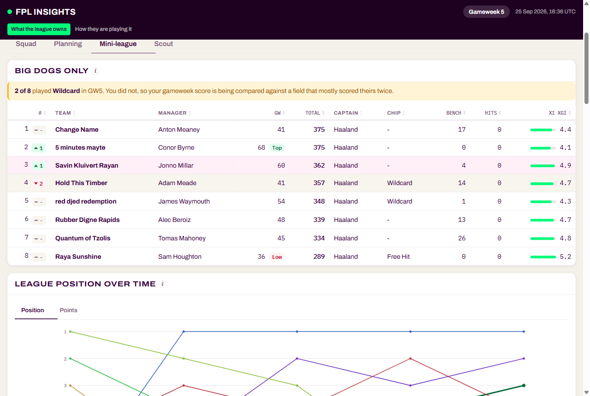

# fpl-insights

A live dashboard for a Fantasy Premier League squad and mini-league. It shows the
numbers behind the points (expected goals, expected assists, defensive
contributions, bookmaker-implied fixture strength) and turns them into
decisions: who to captain, who to sell, when to play a chip.

**Live: https://fpl-insights-jm.vercel.app** (rebuilt automatically every three hours)



| Planning | Mini-league |
|---|---|
|  |  |

## Why I built this

FPL's own site tells you what happened (points) but not why, and not whether
it will happen again. A defender with 15 points from one lucky goal and a
midfielder quietly racking up chances look the same in the points column. I
wanted the underlying numbers per match, in one place, next to the decisions
they should inform, and I wanted my mini-league's results explained rather
than just ranked.

It also became a real exercise in working with messy public data: four
sources with no shared keys, an expected-points model built because FPL's own
projection is unusable (26 distinct values across 515 players, capped at 4.0),
and a pipeline that has to keep running unattended.

## Tech stack

- **Python 3.9+, standard library only** for fetching, modelling and rendering.
  No framework and no required third-party packages.
- **Vanilla JavaScript** for the interactive parts (sorting, charts, the player
  dialog, the Scout filters). No build step.
- **Output is one self-contained HTML file.** Images are embedded as data URIs,
  so the page works offline and can be hosted anywhere as a static file.
- **GitHub Actions** rebuilds it on a schedule; **Vercel** serves it and
  redeploys on every commit.
- **pytest** for the tests. **Pillow** is optional: when installed it shrinks
  player photos from ~96 KB PNGs to ~14 KB JPEGs; without it the build still
  works, the page is just heavier. CI installs it.

Built with Claude Code as a pair programmer.

## Run it

```
python cli.py dashboard --open     the whole thing as a web page
python cli.py team                 your 15, with per-match xG/xA
python cli.py league               how your rivals are doing, and why
python cli.py player szoboszlai    one player, in detail
python -m pytest                   the tests
```

`config.json` holds the FPL ids to report on. The committed one points at my
own team and mini-league, so everything above runs straight after a clone.
To use your own:

```json
{
  "entry_id": 3385667,
  "league_id": 1453141
}
```

Your `entry_id` is the number in the URL when you view your own team
(`/entry/<id>/event/1/`). The `league_id` is the number in a mini-league URL.
Both can also be passed as `--entry` / `--league`.

Responses are cached in `.cache/` for 15 minutes. `--ttl 0` forces a refresh.

## The dashboard

`python cli.py dashboard --open` writes `dashboard.html` and opens it. Re-run it
whenever you want current numbers. `--artifact` also writes a body-only copy,
`dashboard-artifact.html`, which is what the live site serves.

Four tabs:

- **Squad**: pitch view (Overview, a Pick Team view with next-fixture and form
  context, and last gameweek), a sortable detail table, and findings cards.
  Click any player for their match-by-match log and Opta stats.
- **Planning**: what the bookmaker odds imply for the next gameweek, the
  highest projected XI, transfer suggestions and pairs, captaincy, a chip
  planner (Free Hit, Triple Captain, Bench Boost, Wildcard), a fixture ticker,
  price-change watch and elite-manager ownership.
- **Mini-league**: standings with each rival's gameweek score, captain, chip
  and the underlying xGI of their starting XI, position over time, the league
  template, differentials and what rivals are scoring from.
- **Scout**: position-by-position labs for finding players, filterable by
  price, minutes and team, with fixture runs.

Styling follows FPL's own stylesheet: brand purple `#37003c` as ink, their
bright green `#01fc7a` as the single accent, their five-step fixture-difficulty
colours. Light theme only. FPL's typeface is a licensed Monotype face, so the
page uses Archivo (on its width axis, expanded for headings) with IBM Plex Mono
for every figure so columns of numbers align. Difficulty pills always carry a
visible opponent and number, because two of FPL's steps sit at 1.35:1 and
1.2:1 against white and colour alone would not be readable.

## How it works

```
fplapi.py           FPL API client: retries, backoff, 15-minute disk cache
analysis.py         per-player reports, findings, the expected-points model
odds.py             Pinnacle odds -> expected goals and clean-sheet chances
pulse.py            Premier League Opta stats, joined on Opta id
ffs.py              Fantasy Football Scout predicted line-ups
elite.py            ownership among the top of the global league
transfers.py        transfer and pair suggestions
chips.py            chip planner
captaincy.py        captaincy model
scout.py            the Scout tab's player pools
ticker.py           fixture ticker and runs

dashboard.py        page assembly: build() gathers data and cards, render() wraps them
cards_*.py          one module per tab (squad, planning, league, scout) plus shared helpers
components.py       chart-like building blocks shared across cards
dashboard.css/.js   the page's styles and script; the other .js files are per-feature
cli.py              the command-line entry point
```

### Sources beyond FPL

**Bookmaker odds**: Pinnacle's public guest API, no key. Pinnacle runs on low
margins and high limits, so its line is close to a market consensus. The total
line nearest even money gives the match's expected goals, the handicap line
nearest even gives the supremacy, and those two solve for each side's expected
goals. A clean sheet is then the opponent failing to score under a Poisson
model, `exp(-m)`. That last step is an assumption (Poisson slightly understates
0-0 draws), so it is labelled as derived, not quoted, wherever it appears.

**Predicted line-ups**: Fantasy Football Scout's team-news page. FPL's API says
nothing about who will start. FFS renders each predicted starter with a photo
whose filename is the same id FPL exposes in `element["photo"]`, so the two
join on a number, not a name. If the page fails to parse, the feature reports
nothing rather than marking everyone benched.

**Premier League Opta stats**: `footballapi.pulselive.com`, the open API behind
premierleague.com. Big chances created and missed, shots, shots on target,
dribbles and touches, none of which FPL shows. The join is exact: Pulselive
returns `altIds: {"opta": "p223094"}` and FPL carries the identical string in
`element["opta_code"]`. Two quirks: ids come back as floats and must be cast to
int for URLs, and the ranked endpoints only include Opta ids when asked with
`altIds=true`.

**Elite ownership**: FPL's global league (id 314) is public and ranked, so the
top managers' squads can be read like a mini-league rival's. Ownership among
that group separates "popular" from "popular with people who are winning".
Early in a season, though, the current top of that table is mostly a
survivorship sample: two or three lucky captaincy picks, not evidence of
judgement. So the reference group is "proven" managers: of the current top
250 (`--elite N` to change it, `0` to skip), only those who finished inside the
top 100,000 last season count. That buys a season-plus of track record at the
cost of a smaller sample, so every ownership figure carries its 95% margin of
error, and a gap smaller than twice that margin is treated as no difference.

**Price-change forecasts**: FPL's own `price_change_percent` and
`price_change_projections`, which the site does not surface. Positive rises,
negative falls, and the change fires at 100.

Sources checked and rejected: FBref (403), FotMob (404), Sofascore (403), and
Fantasy Football Scout's projected points and DefCon tables, which show names
to anonymous visitors but strip the numbers (that is their paid product).

## How it stays current

**GitHub Actions builds it** (`.github/workflows/build.yml`) every three hours,
commits `dashboard-artifact.html` if the page changed, and warns in the run log
if any data source dropped out. Every run ends with a source-health block, so a
broken scrape shows up as a `FAIL` line rather than a section quietly vanishing.

Three-hourly rather than twice a day because GitHub's scheduler is best-effort:
the very first scheduled run here was skipped outright, with no error, leaving
an eight-hour-old page live. Eight chances a day makes a dropped run a
non-event, and runs where nothing changed exit without committing. Prices
change around 01:30 UK, so early builds catch them; predicted line-ups sharpen
through the day, so later builds land before a typical 18:30 deadline.

**Vercel deploys it.** The Vercel project is linked to this repo, so every build
that changes the page triggers a fresh deploy with no extra step. This replaced
a second scheduled job that republished the page twice a day and quietly
stopped running with no error. Deploying off the git push removes that failure
mode rather than monitoring it better. The remaining gap: if the GitHub Action
itself stops firing, the page looks fine while falling behind, and the backstop
is GitHub's own failure email.

**The built HTML is committed.** A 2.2 MB page eight times a day sounds
expensive, but the embedded images are byte-identical between builds, so git
deltas them away. Measured across two consecutive builds: zero growth.

## Notes on the data

**Per-match history is current season only.** `element-summary` gives one row
per fixture for this season, but only totals for earlier seasons. Those totals
are used as a baseline while the current season is short. For older per-match
data, `github.com/vaastav/Fantasy-Premier-League` archives it as CSV per
gameweek from 2016/17.

**Defensive contribution.** FPL awards 2 points for hitting a threshold in a
match: 10 for defenders (clearances, blocks, interceptions, tackles), 12 for
midfielders and forwards (the same plus recoveries). The API's
`defensive_contribution` field is already composed correctly per position
(verified against the raw components rather than assumed), so only the
threshold differs.

**Early season.** Per-90 rates over one or two matches are noise. The report
says so when players are under 270 minutes and falls back to last-season
baselines.

**FPL's xG is Opta's.** Understat runs a different model and will not agree:
for 2025/26 Haaland was 25.50 xG by FPL and 28.80 by Understat. The two are
never mixed in one number.

## Two environment quirks this handles

- **`curl` cannot reach the FPL API from my machine**: the TLS handshake fails
  (curl exit 35) while Python's `urllib` succeeds against the same host, so
  everything uses `urllib`.
- **Connection resets.** Requests on my network intermittently die with
  WinError 10054, so every fetch retries with backoff.
